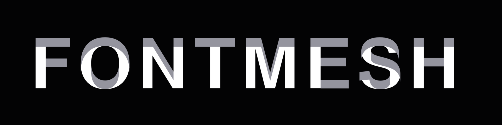
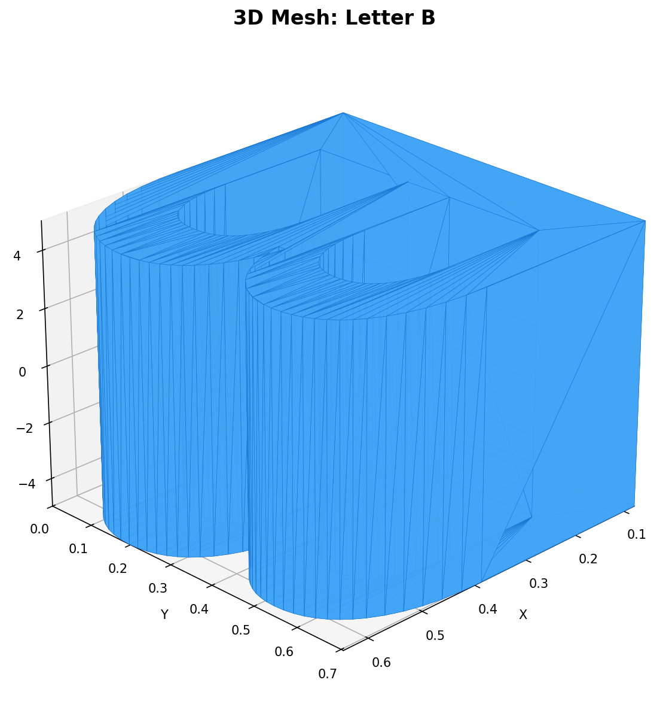
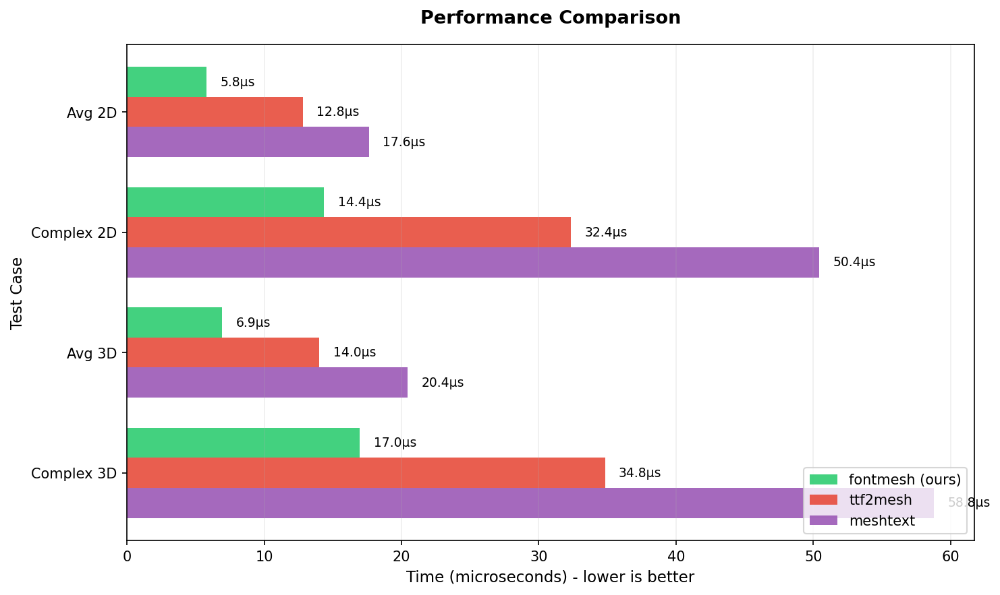

# fontmesh

[](https://github.com/PoHsuanLai/fontmesh/actions)
[](https://crates.io/crates/fontmesh)
[](https://docs.rs/fontmesh)
[](LICENSE-MIT)

Library for converting TrueType font glyphs to 2D and 3D triangle meshes. A faster, pure Rust alternative to [ttf2mesh](https://github.com/blaind/ttf2mesh-rs).

<p align="center"></p>

<p align="center">
  
  
</p>

## Quick Start

```rust
use fontmesh::{Face, char_to_mesh_2d, char_to_mesh_3d};

let font_data = include_bytes!("font.ttf");
let face = Face::parse(font_data, 0)?;

// 2D mesh with 20 subdivisions per curve
let mesh_2d = char_to_mesh_2d(&face, 'A', 20)?;

// 3D mesh with depth 5.0 and 50 subdivisions
let mesh_3d = char_to_mesh_3d(&face, 'A', 5.0, 50)?;
```

## Caching
```rust
use std::collections::HashMap;
use std::sync::Arc;

// Cache just the font data
let mut cache: HashMap<String, Arc<Vec<u8>>> = HashMap::new();
cache.insert("myfont".into(), Arc::new(font_data.to_vec()));

// Parse Face when needed (cheap!)
let data = cache.get("myfont").unwrap();
let face = Face::parse(data, 0)?;
let mesh = char_to_mesh_3d(&face, 'A', 5.0, 20)?;
```

## Examples

```bash
cargo run --example basic
cargo run --example export_obj
cargo run --example serde --features serde
```

## Performance

fontmesh is **2-3x faster** than comparable libraries.

<p align="center">
  
</p>

Run benchmarks: `cargo bench`

## License

Licensed under either of [MIT](LICENSE-MIT) or [Apache-2.0](LICENSE-APACHE) at your option.
