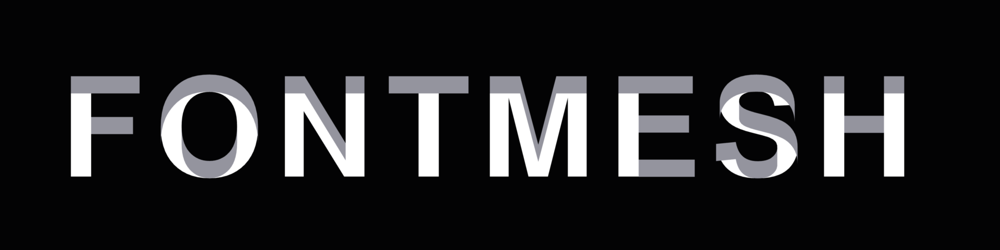
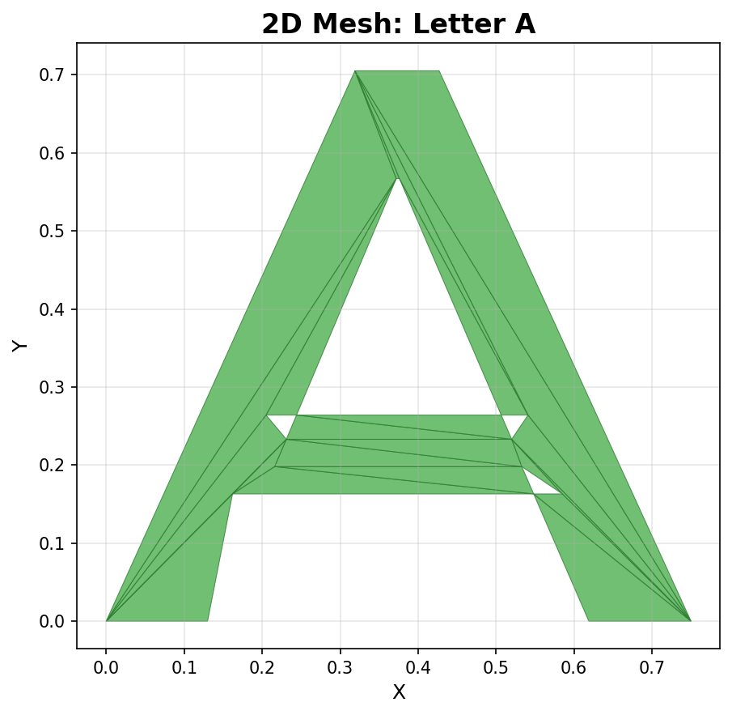
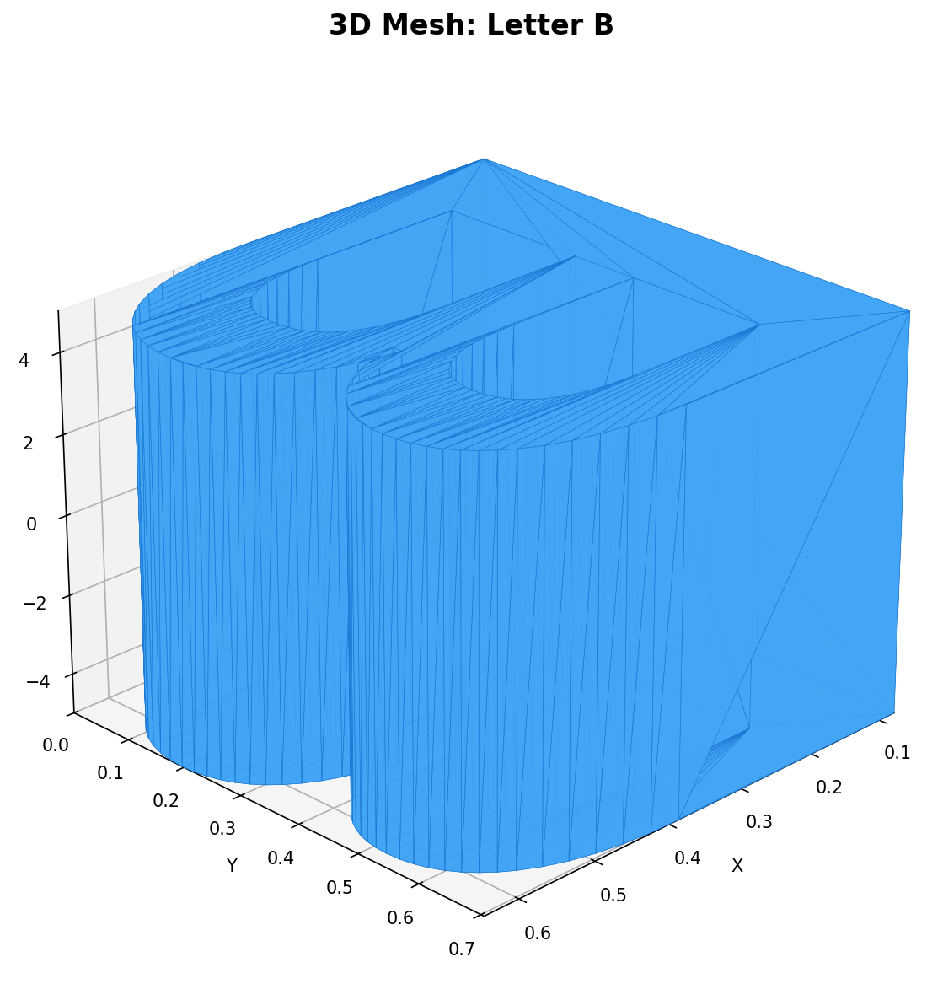
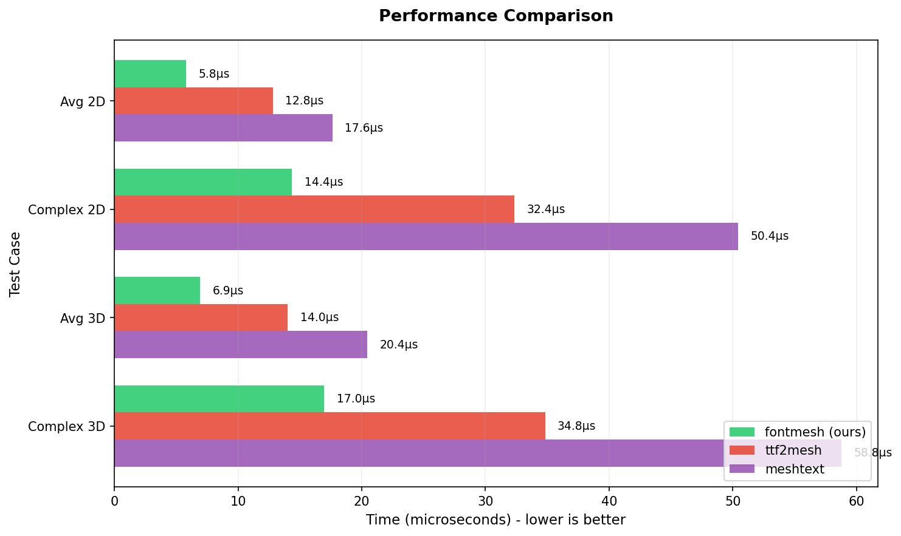

# fontmesh

[](https://github.com/PoHsuanLai/fontmesh/actions)
[](https://crates.io/crates/fontmesh)
[](https://docs.rs/fontmesh)
[](LICENSE-MIT)

Library for converting font glyphs to 2D and 3D triangle meshes. A faster, pure Rust alternative to [ttf2mesh](https://github.com/blaind/ttf2mesh-rs).

Font parsing is handled by [`skrifa`](https://crates.io/crates/skrifa), so both TrueType (`glyf`) and OpenType with CFF/PostScript outlines are supported, and the same parsed-font handle plugs straight into shaping libraries like `cosmic-text`.

<p align="center"></p>

<p align="center">
  
  
</p>

## Quick Start

```rust
use fontmesh::{parse_font, glyph_id, glyph_to_mesh_2d, glyph_to_mesh_3d};

let font_data = include_bytes!("font.ttf");
let font = parse_font(font_data)?;
let gid = glyph_id(&font, 'A').expect("font contains 'A'");

// 2D mesh with 20 subdivisions per curve
let mesh_2d = glyph_to_mesh_2d(&font, gid, 20)?;

// 3D mesh with depth 0.1 em and 50 subdivisions
let mesh_3d = glyph_to_mesh_3d(&font, gid, 0.1, 50)?;
```

Output coordinates are normalised to **1.0 em** — `depth = 0.1` is 10 % of the font's em square.

## Working with a shaper

If you already have a `skrifa::FontRef` or `skrifa::GlyphId` from a shaper (cosmic-text, harfbuzz, …), pass it straight in — no extra parse is needed:

```rust
use fontmesh::{FontRef, GlyphId, glyph_to_mesh_3d};

let font: FontRef = /* from your shaper */;
let gid: GlyphId = /* from your shaper */;
let mesh = glyph_to_mesh_3d(&font, gid, 0.1, 20)?;
```

## Examples

```bash
cargo run --example basic
cargo run --example obj
```

## Performance

fontmesh is **2-3x faster** than comparable libraries.

<p align="center">
  
</p>

Run benchmarks: `cargo bench`

## License

Licensed under either of [MIT](LICENSE-MIT) or [Apache-2.0](LICENSE-APACHE) at your option.
