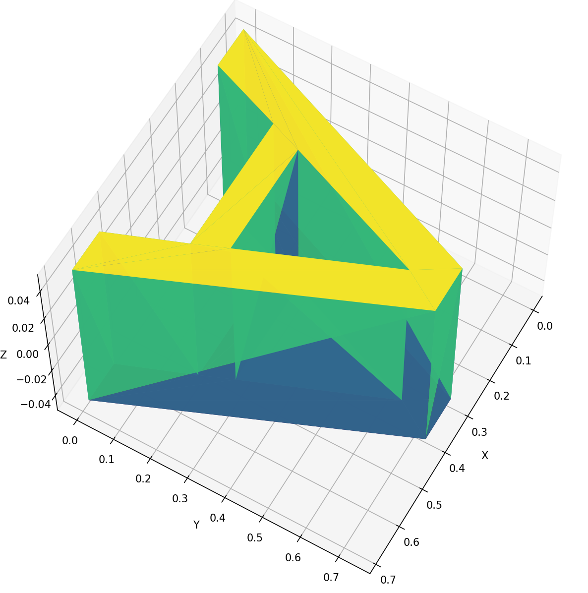

# fontmesh

[](https://github.com/PoHsuanLai/fontmesh/actions)
[](https://crates.io/crates/fontmesh)
[](https://docs.rs/fontmesh)
[](LICENSE)

A fast Rust library for converting TrueType font glyphs to 2D and 3D triangle meshes.

<p align="center">
  
  
</p>

<p align="center">
  
</p>

## Quick Start

```rust
use fontmesh::{Font, Quality};

let font_data = include_bytes!("font.ttf");
let font = Font::from_bytes(font_data)?;

// Generate a 2D mesh
let mesh_2d = font.glyph_to_mesh_2d('A', Quality::Normal)?;

// Generate a 3D mesh with depth
let mesh_3d = font.glyph_to_mesh_3d('A', Quality::High, 5.0)?;
```

## Performance

fontmesh is **2-3x faster** than comparable libraries, with robust triangulation via Lyon.

<p align="center">
  
</p>

Run benchmarks yourself: `cargo bench`

## Examples

```bash
# Basic usage
cargo run --example basic

# Efficient buffer reuse for batch processing
cargo run --example buffer_reuse

# Export glyphs to OBJ format
cargo run --example export_obj
```

## How It Works

1. Parse font with ttf-parser
2. Extract glyph outline (Bezier curves)
3. Linearize curves using adaptive subdivision
4. Triangulate with lyon_tessellation
5. Optional: Extrude to 3D with smooth normals

## Dependencies

- **ttf-parser** - Font parsing (pure Rust, no_std)
- **lyon_tessellation** - Robust triangulation
- **glam** - Vector math

## License

MIT
