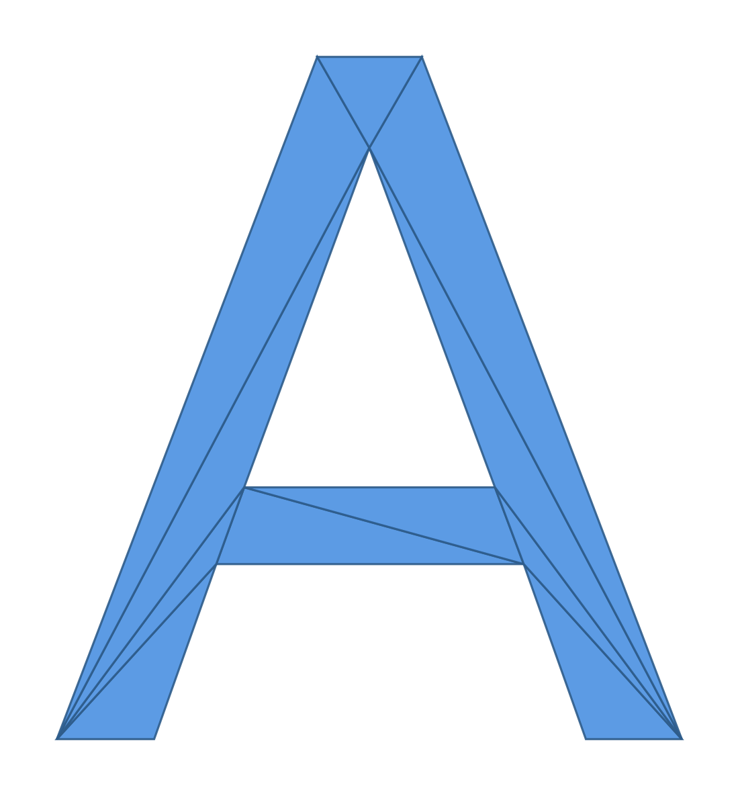

# fontmesh

[](https://github.com/PoHsuanLai/fontmesh/actions)
[](https://crates.io/crates/fontmesh)
[](https://docs.rs/fontmesh)
[](LICENSE)

A fast Rust library for converting TrueType font glyphs to 2D and 3D triangle meshes. A faster, pure Rust alternative to [ttf2mesh](https://github.com/blaind/ttf2mesh-rs).

<p align="center"></p>

<p align="center">
  
  
</p>

## Quick Start

```rust
use fontmesh::Font;

let font = Font::from_bytes(include_bytes!("font.ttf"))?;

// 2D mesh
let mesh_2d = font.glyph_to_mesh_2d('A')?;

// 3D mesh with custom quality
let mesh_3d = font.glyph_by_char('A')?
    .with_subdivisions(50)
    .to_mesh_3d(5.0)?;
```

## Examples

```bash
cargo run --example basic
cargo run --example export_obj
cargo run --example serde --features serde
```

## Performance

fontmesh is **2-3x faster** than comparable libraries.

<p align="center">
  
</p>

Run benchmarks: `cargo bench`

## License

MIT
